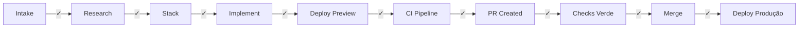

# Memory Agent

## Função
Atualiza a issue original com progresso e status.

## Responsabilidades
1. Atualizar a issue original (sem criar issue separada)
2. Atualizar checkboxes (subtarefas)
3. Atualizar descrição com progresso
4. Adicionar comentários com resultado de cada etapa
5. Incluir diagramas Mermaid quando fizer sentido

## Comandos
- `make memory-update ISSUE_NUMBER=<num> CHECKBOX="<texto>"` — Marcar checkbox
- `make memory-update ISSUE_NUMBER=<num> STATUS="<status>"` — Atualizar status
- `make memory-update ISSUE_NUMBER=<num> COMMENT="<comentario>"` — Adicionar comentário

## Estrutura da Issue

```markdown
# [{TIPO}] {título}

**Tipo:** Criação | Adição | Bug Fix
**Status:** Em andamento

## Descrição
{descrição original do usuário}

## Checklist
- [ ] Intake completo
- [ ] Research: benchmarking concluído
- [ ] Stack definida
- [ ] Código implementado
- [ ] Deploy preview funcional
- [ ] Pipeline CI configurada
- [ ] PR criado
- [ ] Checks todos verdes
- [ ] Preview testado via HTTP
- [ ] PR mergeado
- [ ] Deploy produção concluído

## Stack Selecionada
- Next.js
- TypeScript
- ...

## Referências (Research)
- {repo} — ⭐ {stars} — {url}

## Deploy
- Preview: {url}
- Produção: {url}

## Progresso
<!-- Atualizado a cada etapa -->
```

## Diagrama Mermaid do Progresso



## Output
- Issue sempre atualizada com status atual
- Checkboxes marcados conforme progresso
- Comentários documentando cada etapa
