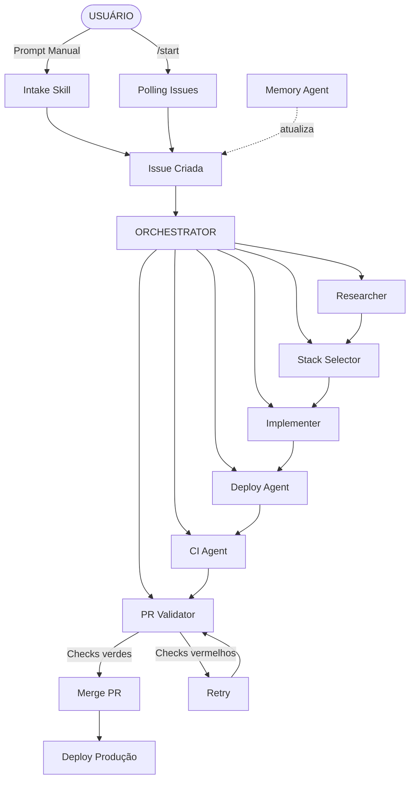

# AGENTS.md — Regras para Agentes

## Regras Gerais

1. **NUNCA executar comandos diretamente** — SEMPRE via `make <target>`
   - Proibido: `gh`, `curl`, `jq`, `yq`, `npm run`, `jest`, etc. diretamente
   - Exceção: comandos internos do agente (ler arquivos, escrever código)
2. **Repositório obrigatório** — O usuário DEVE ter um repo no GitHub (criado via "Use this template")
3. **Precedência** — O que está no AGENTS.md tem precedência sobre definições de agentes/skills

## Orquestração

O agente primário é o orquestrador. Ao receber uma task, execute as etapas na ordem:

**CRÍTICO:** Após CADA etapa do pipeline, SEMPRE execute `make memory-update ISSUE_NUMBER=<num> CHECKBOX="<texto exato do checkbox>"` para marcar o checkbox correspondente no corpo da issue. Não pule essa etapa — os checkboxes `[ ]` devem virar `[x]` em tempo real. Ao final do pipeline, execute `make memory-finalize ISSUE_NUMBER=<num>` para marcar todos os checkboxes restantes e fechar a issue.

### Pipeline completo (criação de projeto)
1. **Research** — Leia `.memotetek/agents/researcher.md` → execute `make search-projects QUERY="<palavras-chave>"` → `make memory-update ISSUE_NUMBER=<num> CHECKBOX="Research: benchmarking concluído"`
2. **Stack** — Leia `.memotek/agents/stack-selector.md` → defina a stack → `make memory-update ISSUE_NUMBER=<num> CHECKBOX="Stack definida"`
3. **Implement** — Leia `.memotek/agents/implementer.md` → execute `make scaffold PROJECT_NAME="."` → `make memory-update ISSUE_NUMBER=<num> CHECKBOX="Código implementado"`
4. **Deploy** — Leia `.memotek/agents/deploy-agent.md` → execute `make gh-actions-setup && make deploy-preview` → `make memory-update ISSUE_NUMBER=<num> CHECKBOX="Deploy preview funcional"`
5. **CI** — Leia `.memotek/agents/ci-agent.md` → valide `make install && make lint && make typecheck && make test && make build` → `make memory-update ISSUE_NUMBER=<num> CHECKBOX="Pipeline CI configurada"`
6. **PR** — Leia `.memotek/agents/pr-validator.md` → execute `make pr-create` → `make memory-update ISSUE_NUMBER=<num> CHECKBOX="PR criado"`
7. **Validação + Merge** — `make pr-merge PR_NUMBER=<num>` (o script aguarda os checks terminarem, até 15min, e mergeia automaticamente se verdes) → `make memory-update ISSUE_NUMBER=<num> CHECKBOX="Checks todos verdes"` → `make memory-update ISSUE_NUMBER=<num> CHECKBOX="PR mergeado"` → `make deploy-production` → `make memory-update ISSUE_NUMBER=<num> CHECKBOX="Deploy produção concluído"`
8. **Finalizar** — `make memory-finalize ISSUE_NUMBER=<num>` (marca todos os checkboxes restantes + fecha a issue)
   - **Não pergunte ao usuário antes de mergear** — se os checks estão verdes, merge é automático
   - Se checks falharem, diagnosticar via `gh pr checks`, corrigir, push, e reexecutar `make pr-merge`
   - Os textos do CHECKBOX devem corresponder EXATAMENTE aos rótulos do template `feature_request.yml`

### Ciclo parcial (adição/correção)
1. Leia o agente correspondente em `.memotek/agents/`
2. Execute o make target apropriado
3. Atualize a issue com `make memory-update ISSUE_NUMBER=<num> CHECKBOX="<etapa>"`

### Regra de ouro
- Antes de cada etapa, leia o agente correspondente em `.memotek/agents/`
- Cada etapa deve ser concluída antes de passar para a próxima
- Se uma etapa falhar, reporte na issue e aguarde decisão do usuário

## Estrutura do Repo-Projeto

Ao clonar via "Use this template", o repo-projeto já contém tudo necessário. Após `make scaffold PROJECT_NAME="."`, a estrutura é:

```
repo-projeto/
├── src/                    ← código do projeto
├── package.json
├── Makefile
├── jest.config.js
├── jest.setup.ts
├── playwright.config.ts
├── .gitignore
├── .env-example
├── AGENTS.md
├── .memotek/               ← agentes e scripts
│   ├── agents/
│   ├── skills/
│   ├── scripts/
│   ├── templates/
│   └── ...
└── .github/workflows/      ← CI/CD
```

## Pipeline de Implementação

```
USUÁRIO (input)
├── Prompt manual → Intake faz perguntas → Cria issue no GitHub
└── /start → Verifica e processa issues abertas
         │
         ▼
    ┌─────────────────────────────────────┐
    │  ISSUE CRIADA (feature_request.yml) │
    └──────────────┬──────────────────────┘
                   │
                   ▼
    ┌────────────────────────────────────────────────────────────────┐
    │                      ORCHESTRATOR                             │
    └──┬──────────┬──────────┬──────────┬──────────┬──────────┬─────┘
       │          │          │          │          │          │
       ▼          ▼          ▼          ▼          ▼          ▼
    Research   Stack     Implement   Deploy      CI       PR
    Searcher  Selector                Agent     Agent   Validator

    Todos executam via: make <target>
```



## Etapas do Pipeline

| # | Etapa | Agente | Ação | Make Target |
|---|-------|--------|------|-------------|
| 1 | Input | - | Usuário clona template via "Use this template" | - |
| 2 | Intake | Intake (skill) | Cria issue GitHub com template de perguntas | `make memory-update` |
| 2.1 | Polling | - | Usuário digita `/start` para verificar issues | `make listen-issues` |
| 3 | Research | Researcher | Busca projetos open source no GitHub | `make search-projects` |
| 3.1 | Benchmarking | Researcher | Analisa top 3 por stars | (interno) |
| 3.2 | Fallback | Researcher | Se nada encontrado, pergunta ao usuário | (interação) |
| 4 | Stack | Stack Selector | Seleciona da lista predefinida | (interno) |
| 5 | Implement | Implementer | Configura projeto Next.js via scaffold | `make scaffold PROJECT_NAME="."` |
| 6 | Deploy | Deploy Agent | Configura preview na Vercel | `make gh-actions-setup` + `make deploy-preview` |
| 7 | CI | CI Agent | Configura pipeline de testes | `make gh-actions-setup` |
| 8 | Validate | PR Validator | Monitora checks, testa preview URL | `make test-preview` |
| 8.1 | Merge | PR Validator | Merge PR quando tudo verde | `make pr-merge` |
| 8.2 | Prod | PR Validator | Deploy produção | `make deploy-production` |
| 9 | Memory | Memory Agent | Atualiza issue com progresso + Mermaid | `make memory-update` |

## Targets do Makefile

### Pipeline (memotek)
| Target | Descrição |
|--------|-----------|
| `make scaffold` | Cria/configura projeto Next.js |
| `make gh-actions-setup` | Copia workflows para .github/workflows/ |
| `make memory-update` | Marca checkbox no corpo da issue |
| `make memory-finalize` | Marca TODOS checkboxes + fecha a issue |
| `make search-projects` | Busca projetos similares no GitHub |
| `make listen-issues` | Polling de issues abertas |
| `make test-preview` | Testa preview URL via HTTP |
| `make pr-create` | Cria Pull Request |
| `make pr-merge` | Merge Pull Request |
| `make deploy-preview` | Deploy preview na Vercel |
| `make deploy-production` | Deploy produção na Vercel |
| `make setup-vercel-secrets` | Configura secrets Vercel no GitHub Actions |

### CI/CD (repo-projeto)
| Target | Descrição |
|--------|-----------|
| `make install` | Instala dependências (npm ci ou npm install) |
| `make lint` | Roda linter |
| `make typecheck` | Verifica tipos (tsc --noEmit) |
| `make build` | Builda o projeto |
| `make test` | Roda testes unitários (Jest) |
| `make install-playwright` | Instala Playwright + Chromium |
| `make test-e2e` | Roda testes E2E (Playwright) |

## Três Tipos de Input

### 1. Criação Inicial de Projeto
Exemplo: "Criar um sistema para cadastro de componentes químicos"
- Issue com campos: tipo de projeto, persistência, stack desejada, referências
- Aciona pipeline completo: intake → research → stack → implement → deploy → CI

### 2. Adição ao Sistema
Exemplo: "Adicionar campo de cor para cada componente químico no formulário"
- Issue com campos: afeta quais arquivos/components, dependências
- Aciona ciclo parcial: intake → implement → deploy preview → test → merge

### 3. Correção de Bug
Exemplo: "O campo abreviação não está salvando letras maiúsculas"
- Issue com campos: passos para reproduzir, comportamento esperado vs atual
- Aciona ciclo de fix: intake → diagnose → fix → test → merge

## Stack Predefinida

- **Next.js** — Framework
- **React** — UI
- **Vercel** — Deploy
- **Supabase** — Backend/Database (opcional via `SUPABASE=1`)
- **Playwright** — E2E tests
- **TypeScript** — Language
- **Jest** — Unit tests
- **GitHub Actions** — CI/CD pipeline
