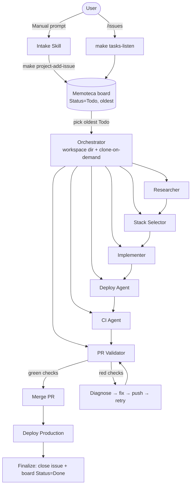

# memoteca

**memoteca** is a GitHub **template repository** that ships an agent orchestration pipeline (the "harness") for scaffolding and shipping Next.js projects end-to-end. memoteca itself is **not** an app — it has no `package.json`, no `src/`, no Next.js project. It is the orchestration layer only.

## repo-template vs repo-project

| | **memoteca** (repo-template, this repo) | **repo-project** |
|---|---|---|
| What it is | A GitHub template | A repo created from this template via "Use this template" |
| Ships | `.memoteca/`, `Makefile`, issue template, `opencode.json`, `AGENTS.md`, `README.md`, `.env-example` | Everything in memoteca PLUS a scaffolded Next.js app |
| Has `package.json` / `src/` | ❌ No | ✅ Yes (after `make scaffold`) |
| `make install` / `lint` / `build` / `test` work | ❌ No (will fail) | ✅ Yes |
| Pipeline runs here | ❌ No | ✅ Yes |
| Vercel preview/production URL | N/A | `{PREVIEW_URL}` / `{PRODUCTION_URL}` |

### What scaffold preserves

`make scaffold PROJECT_NAME="."` runs `create-next-app` **in-place** in the repo-project and adds the Next.js app, while **preserving** these template files: `.memoteca`, `.github`, `AGENTS.md`, `Makefile`, `opencode.json`, `.env-example`, `.git`, `.gitignore`.

## Quick start

1. On GitHub, click **"Use this template"** → name your new repo (the **repo-project**).
2. Clone it locally.
3. **One-time central board setup** (private, cross-repo, personal account):

   ```
   make project-create          # creates the private "Memoteca" GitHub Project + Status/Task Type fields
   make project-link-repo       # links the current repo so its issues can be added to the board
   ```

   Requires the `project` scope: `gh auth refresh -s project` (if not set).
4. Open an issue in the repo-project using the **"Feature Request / Task"** template (auto-labels `memoteca`).
5. Add the issue to the central board:

   ```
   make project-add-issue ISSUE_URL=https://github.com/<owner>/<repo>/issues/<NN>
   ```

   (Optional: configure **Auto-add** in the Projects V2 web UI so `memoteca`-labelled issues are added automatically — filter label = `memoteca`.)
6. **Dispatch** — the board is the cross-task queue:

   ```
   make tasks-listen            # lists items Status=Todo (oldest first) and prints the next command
   make process-issue ISSUE_URL=<url>
   ```

   The orchestrator runs the full pipeline **automatically**, including filling the placeholders below:

   ```
   research → stack → scaffold (in-place) → deploy preview → CI → PR → merge → production → finalize
   ```

   Progress is tracked as checkboxes on the issue body AND mirrored to the board's `Status` single-select (Backlog / Todo / Research / Implementation / Review / PR/Merge / Deploy / Done).

## Agent Runtime Support (Hermes Agent, OpenCode)

This template is agent-runtime-agnostic. The pipeline targets **Hermes Agent** and **OpenCode** as first-class runtimes.

| Concept | Hermes Agent | OpenCode |
|---|---|---|
| Project context | `.hermes.md` (walks parents to git root, auto-loaded) | `opencode.json` `instructions` |
| Skills | YAML-frontmatter `SKILL.md` under `.memoteca/skills/`, installed via `make hermes-setup` | `opencode.json` `skills.paths` |
| Sub-agents | `delegate_task(goal=...)` (single) or `delegate_task(tasks=[...])` (batch, up to 3) | `task` / `invoke` |
| Persistent memory | `memory` tool (user + memory stores) | N/A |

### Hermes Agent setup

After scaffolding the repo-project, install the 3 memoteca skills into your Hermes profile:

```
make hermes-setup
```

This symlinks (POSIX) or copies (Windows) the skills from `.memoteca/skills/` into `~/.hermes/skills/` (or `$HERMES_HOME/skills/`). Then start a new Hermes session (`/reset` or `hermes`) and load the main skill:

```
hermes -s memoteca-assistente
```

The `.hermes.md` file at the repo root is auto-loaded by Hermes when working in this repo and provides the full Hermes project context.

## Placeholders — filled by the AGENT, not the human

A repo-project created from this template contains these placeholders in its `README.md` and in the repo-project sections of its `AGENTS.md`. They are filled **automatically by the Implementer agent** during the pipeline — Ronan does **not** edit them by hand:

- `{PROJECT_NAME}` — repo / project name (filled at scaffold step)
- `{PROJECT_DESCRIPTION}` — one-line description (filled at scaffold step)
- `{REPO_URL}` — `https://github.com/<owner>/<repo>` (filled at scaffold step)
- `{PREVIEW_URL}` — Vercel preview URL (filled after the first `make deploy-preview`)
- `{PRODUCTION_URL}` — Vercel production URL (filled after the first `make deploy-production`)

## Pipeline overview



Full agent-by-agent detail lives in [`AGENTS.md`](./AGENTS.md) and `.memoteca/agents/*.md`.

## Stack

Next.js (App Router, TypeScript, Tailwind, `src/` dir, `@/*` alias) · React · Chakra UI · Vercel · Supabase (opt-in via `SUPABASE=1`) · Jest · Playwright · GitHub Actions.

## Three input types

1. **Project creation** → full pipeline (intake → finalize).
2. **System addition** → partial: intake → implement → preview → test → merge.
3. **Bug fix** → intake → diagnose → fix → test → merge.

## Useful make targets

| Target | Where it runs | Description |
|---|---|---|
| `make project-create` | both (once) | Create the private "Memoteca" GitHub Project + Status/Task Type fields |
| `make project-link-repo [REPO=o/r]` | both (once per repo) | Link a repo to the board so its issues can be added |
| `make project-add-issue ISSUE_URL=...` | both | Add a `memoteca`-labelled issue to the board (sets Status=Todo + parses Task Type) |
| `make tasks-listen` | both | Query the board for items Status=Todo (oldest first) — entry point |
| `make process-issue ISSUE_URL=...` | both | Fetch an issue (cross-repo) and print next make targets |
| `make scaffold PROJECT_NAME="."` | repo-project | Adds the Next.js app in-place (preserves template files) |
| `make memory-update ...` | both | Check a checkbox + post comment on the issue AND mirror Status to the board |
| `make memory-finalize ...` | both | Check all remaining + close issue + set board Status=Done |
| `make install` / `lint` / `typecheck` / `build` / `test` / `test-e2e` | repo-project only | Standard JS dev verification |
| `make install-hooks` | repo-project | Install the commit-msg hook enforcing `<type>: <desc> (#<NN>)` |
| `make hermes-setup` | both | Install the 3 memoteca skills into the active Hermes profile skill tree (~/.hermes/skills/) — symlinks on POSIX, copies on Windows |
| `make deploy-preview` / `deploy-production` | repo-project | Vercel deploys |
| `make pr-create` / `pr-merge` | repo-project | PR open + wait-for-checks merge |
| `make gcp` / `gpr` / `gcp-and-gpr` | repo-project | commit+push / PR / both — `gcp` auto-injects `(#NN)` from the `feature/<NN>-<short>` branch |

All CLIs MUST be invoked via `make <target>`, never directly (`gh`, `npm run`, `jest`, ...). See `AGENTS.md` for the why.